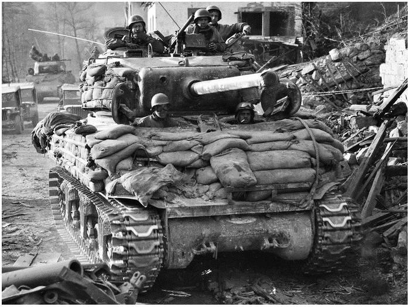

# Centurion Mk 5

FV4007 Centurion var hovedkampvognen for den britiske hær efter Anden Verdenskrig og er kendt som en af de mest succesfulde tankdesigns i efterkrigstiden. Den blev introduceret i 1945 og forblev i produktion indtil 1960'erne, og deltog i kampe helt frem til 1980'erne. Centurion blev udviklet i 1943, og de første seks prototyper ankom til Belgien kort efter krigen sluttede i Europa i maj 1945\. Den blev først brugt i kamp under Koreakrigen i 1950 og deltog senere i konflikter som den Indo-pakistanske krig i 1965 og Vietnamkrigen.

Centurion blev også brugt af den israelske hær under Seksdageskrigen i 1967, Yom Kippur-krigen i 1973 og flere andre konflikter i Mellemøsten. Danmark modtog Centurion i 1953, og den var hærens primære kampvogn indtil 1976\. Den blev moderniseret i 1982 og udfaset i 1999\. Flere varianter blev udviklet til andre roller, som pansrede bjærgningskøretøjer og broer til at udlægge feltbroer under beskydning.