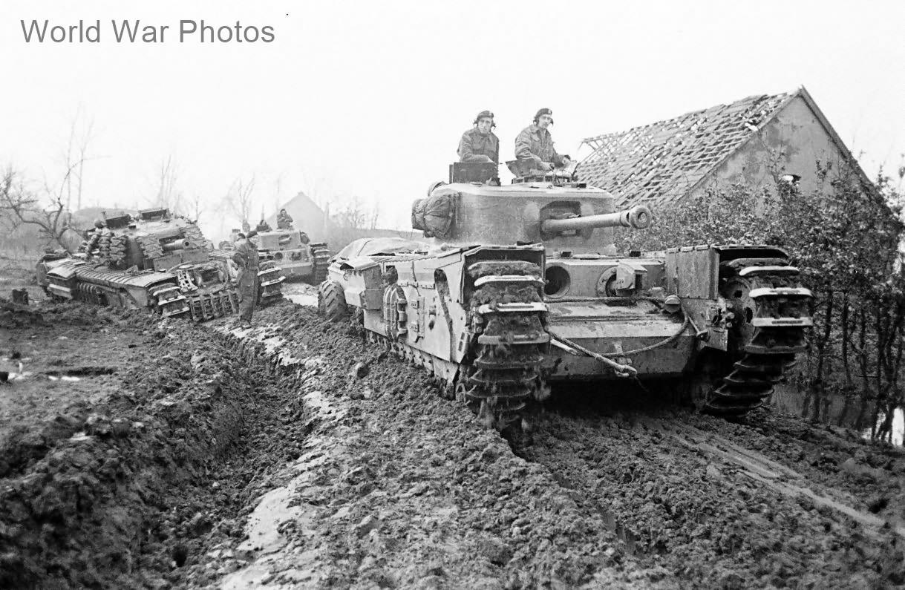

# Churchill Mk VII (A22F)

Churchill er måske den mest kendte britiske \"infanteritank\". Designet
skulle have panser tykt nok til at modstå ild fra ethvert kendt
antitankvåben under udviklingsfasen, mens ildkraften skulle være i
overensstemmelse med tankens opgaver. Høj hastighed var ikke nødvendig,
da tankens tempo skulle matche infanteriet, som bevægede sig til fods.
Churchill-tanks spillede en afgørende rolle i erobringen af Hill 309 den
30. juli 1944 og blev også brugt med succes i Nordafrika, Italien,
Vesteuropa og Korea i 1950\'erne. De første modeller var bevæbnet med en
2-punds kanon, men Mark III og senere versioner fik en 6-punds eller 75
mm kanon. Den sidste model, Mark VII, var en større redesign med
væsentligt tykkere panser end selv den tyske Tiger I.

Churchill Mk VII, også kaldet A22F, blev produceret i 1.600 eksemplarer
sammen med Mark VIII. Dette var den anden store redesign og inkluderede
en 75 mm kanon, bredere krop og markant tykkere panser, som på forsiden
var 50% tykkere end Tiger I\'s. Den blev første gang brugt under slaget
om Normandiet og kunne nemt omdannes til en \"Crocodile\"
flammekastervariant uden store ændringer.
