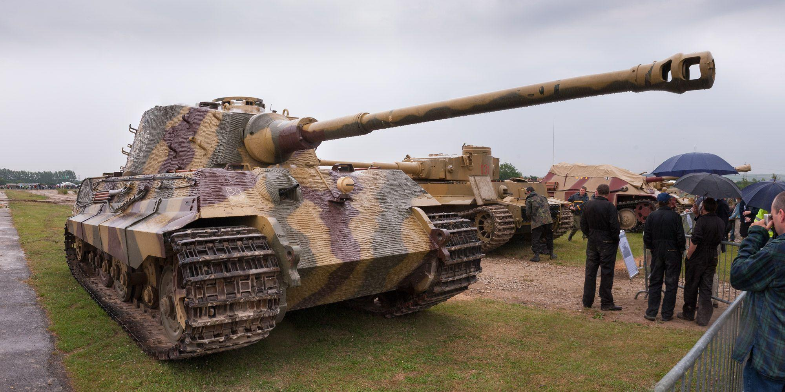

# LEO 1A5DK

**Leopard 1A5DK** er en opgraderet version af den tyske Leopard 1 kampvogn, som blev tilpasset til dansk brug. Leopard 1, oprindeligt udviklet af Tyskland i 1960'erne, blev designet som en hurtig og mobil kampvogn med fokus på bevægelighed og ildkraft, men med mindre vægt på tung pansring, idet det blev antaget, at moderne kampvognsbeskyttelse hovedsageligt skulle komme fra fart og avancerede taktikker.

**Leopard 1A5DK**\-modellen er resultatet af en opgradering af de danske Leopard 1A3-kampvogne i 1990'erne. Opgraderingen havde til formål at forlænge vognens operationelle levetid og forbedre dens evne til at operere i et moderne kampmiljø. Danmark modtog sine første Leopard 1-kampvogne i begyndelsen af 1970'erne, og disse var i tjeneste indtil Leopard 2 senere blev indført som den primære danske kampvogn.

## Specifikationer og opgraderinger af Leopard 1A5DK:

1. **Ildkraft:**  
   * Leopard 1A5DK er bevæbnet med en 105 mm L7 riflet kanon, som har en høj præcision og er effektiv mod både panserkøretøjer og infanteri. Denne kanon er kompatibel med moderne ammunitionstyper, hvilket giver kampvognen mulighed for at engagere sig i kamp mod forskellige mål, inklusive fjendtlige kampvogne og befæstninger.  
2. **Elektronik og ildledelsessystem:**  
   * En af de væsentligste opgraderinger af Leopard 1A5DK var installationen af et moderne ildledelsessystem, der inkluderer termiske sigtemidler, laserafstandsmålere og ballistiske computere. Disse forbedringer gav kampvognen en betydelig fordel i både dag- og natsituationer, da den kunne engagere fjender med større præcision og over længere afstande, selv i dårlig sigtbarhed.  
   * Dette moderne ildledelsessystem gjorde Leopard 1A5DK til en langt mere effektiv kampvogn sammenlignet med tidligere versioner, som var afhængige af mere grundlæggende optik.  
3. **Beskyttelse:**  
   * Selvom Leopard 1 ikke havde den tunge pansring, der karakteriserer moderne kampvogne som Leopard 2, blev Leopard 1A5DK forsynet med opgraderet kompositpanser og add-on pansersæt for at forbedre dens beskyttelse mod moderne antitankvåben.  
   * Pansringen var dog stadig relativt let i forhold til andre kampvogne, hvilket gjorde den mere sårbar over for moderne våben, men dette blev i høj grad opvejet af dens mobilitet og ildkraft.  
4. **Mobilitet:**  
   * Leopard 1A5DK havde en kraftig MTU MB 838 CaM 500 dieselmotor, som gav den en topfart på ca. 65 km/t på veje og omkring 40 km/t i terræn. Med en imponerende rækkevidde på op til 600 km på vej, var den kendt for sin fremragende mobilitet, hvilket gjorde den meget anvendelig i hurtige angreb og defensive operationer.  
   * Kampvognens høje mobilitet gjorde den i stand til hurtigt at flytte sig mellem positioner, hvilket var afgørende i moderne kampdoktriner, hvor hastighed og overraskelse kunne være lige så vigtige som ildkraft.  
5. **Kommunikation og integration:**  
   * Leopard 1A5DK var udstyret med forbedrede kommunikationssystemer, som gjorde det muligt for vognens besætning at kommunikere effektivt med andre enheder på slagmarken. Dette var især vigtigt i den danske hær, hvor kampvognene ofte opererede i tæt samarbejde med infanteri og andre enheder.

## Operationel brug:

Leopard 1A5DK blev brugt af den danske hær fra midten af 1990'erne og frem til begyndelsen af 2000'erne. Den deltog i internationale operationer, herunder i Bosnien under FN og NATO-missioner, hvor den danske hærs Leopard 1 kampvogne spillede en vigtig rolle i at sikre stabilitet og beskytte civile i konfliktområder.

Leopard 1A5DK blev udfaset i Danmark i løbet af 2000'erne, efterhånden som Leopard 2A5 erstattede den som den primære kampvogn i den danske hær. Trods sin pensionering var Leopard 1A5DK en vigtig del af Danmarks panserstyrker og spillede en afgørende rolle i overgangen til moderne kampvognsoperationer i det danske forsvar.