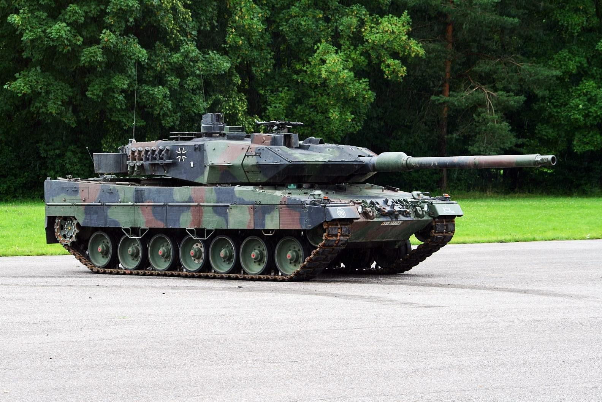

# Leopard 2A5DK

**Leopard 2A5DK** er en dansk version af den tyske Leopard 2A5 kampvogn, som blev tilpasset specifikt til de danske væbnede styrkers krav og behov. Leopard 2-serien er kendt som en af de mest avancerede og effektive kampvogne i verden og er blevet brugt af mange lande. Danmark erhvervede Leopard 2A5 som erstatning for den ældre Leopard 1, og de opgraderede versioner har vist sig at være en kraftig og pålidelig del af Hærens kampstyrker.

## Design og specifikationer:

1. **Bevæbning:**  
   * Leopard 2A5DK er bevæbnet med en **120 mm L/44 Rheinmetall glatløbet kanon**, som giver fremragende præcision og penetrationsevne mod fjendtlige pansrede køretøjer. Kanonen kan affyre forskellige typer ammunition, herunder panserbrydende finstabiliseret pilprojektil (APFSDS) og sprængammunition (HEAT).  
   * Kampvognen har også et **7,62 mm koaksialt maskingevær** monteret ved siden af hovedkanonen, samt et yderligere maskingevær monteret ved tårnet til brug mod infanteri og lavtflyvende mål.  
2. **Panser og beskyttelse:**  
   * Leopard 2A5DK har et modulært kompositpanser, der tilbyder forbedret beskyttelse mod kinetiske projektiler og kemiske våben som raketter og granater. Det modulære design gør det muligt at udskifte beskadigede panserplader i felten.  
   * Kampvognen har også fået tilføjet **kileformede pansrede moduler** på tårnet, hvilket giver bedre beskyttelse mod fjendtlige projektiler, især fra siderne.  
   * Besætningen er yderligere beskyttet af et sofistikeret internt system, der modstår sekundære effekter fra eksplosioner som brand og splinter.  
3. **Mobilitet:**  
   * Leopard 2A5DK drives af en kraftig **MTU MB 873 Ka-501 12-cylindret dieselmotor**, der yder 1.500 hestekræfter, hvilket giver kampvognen en topfart på omkring 68 km/t på vej og en fremragende terrænevne.  
   * Takket være sin avancerede affjedring og hydro-pneumatiske undervogn har Leopard 2A5DK fremragende mobilitet i både kuperet terræn og på ujævne overflader. Kampvognen kan køre gennem dyb sne, mudder og krydse vandforhindringer uden større vanskeligheder.  
4. **Avancerede systemer:**  
   * Leopard 2A5DK er udstyret med et **moderne ildkontrolsystem**, der muliggør præcise skud selv under bevægelse. Dette system er koblet sammen med avancerede sensorer, laserafstandsmålere og termiske billedsystemer, hvilket giver kampvognen evnen til at engagere mål effektivt under alle lysforhold, inklusive om natten.  
   * Kampvognen har også en **stabiliseret kanon**, hvilket betyder, at den kan affyre med høj præcision selv under høj hastighed eller ujævn kørsel.  
   * Et avanceret kommunikationssystem sikrer pålidelig kommunikation mellem besætningen samt med andre enheder i kamp.  
5. **Besætning:**  
   * Leopard 2A5DK har en besætning på fire: **kommandør, skytte, lader og kører**. Hver rolle har specifikke opgaver, der bidrager til kampvognens samlede effektivitet på slagmarken.  
   * Internt er der designet komfortable og ergonomiske arbejdsstationer, som giver besætningen mulighed for at operere over lange perioder under ekstreme forhold.

## Danske modifikationer:

Den danske version af Leopard 2A5, kendt som **Leopard 2A5DK**, har gennemgået flere tilpasninger for at imødekomme de danske forsvarskrav, især med hensyn til kommunikationssystemer og klimatiske forhold. Nogle af disse modifikationer inkluderer:

* **Forbedret kommunikationsudstyr**, som er skræddersyet til det danske forsvar, hvilket giver bedre integration med de nationale forsvarsnetværk og NATO-styrker.  
* **Klimatilpasninger**, der gør kampvognen i stand til at operere i koldere og mere ekstreme vejrforhold, som ofte findes i Nordeuropa.  
* Yderligere tilpasninger i **beskyttelse og ergonomi** for at forbedre besætningens komfort og sikkerhed under længere operationer.

## Operationel brug:

Leopard 2A5DK har spillet en vigtig rolle i Danmarks moderne forsvarsstyrker og er blevet brugt i internationale operationer, herunder træning og øvelser med NATO-allierede. Kampvognen er kendt for sin pålidelighed, ildkraft og fremragende beskyttelse, hvilket gør den til en af de mest frygtede og respekterede kampvogne i verden.

Den har også været anvendt i konfliktområder som Afghanistan, hvor den har ydet støtte til danske styrker og bidraget til operationer under vanskelige terrænforhold.

## Konklusion:

Leopard 2A5DK er en af de mest avancerede kampvogne i det danske forsvar og leverer en fremragende balance mellem ildkraft, mobilitet og beskyttelse. Dens tilpasninger til danske forhold og dens evne til at integrere sig med NATO-standarder gør den til en uundværlig del af Danmarks militære kapacitet i moderne konflikter.