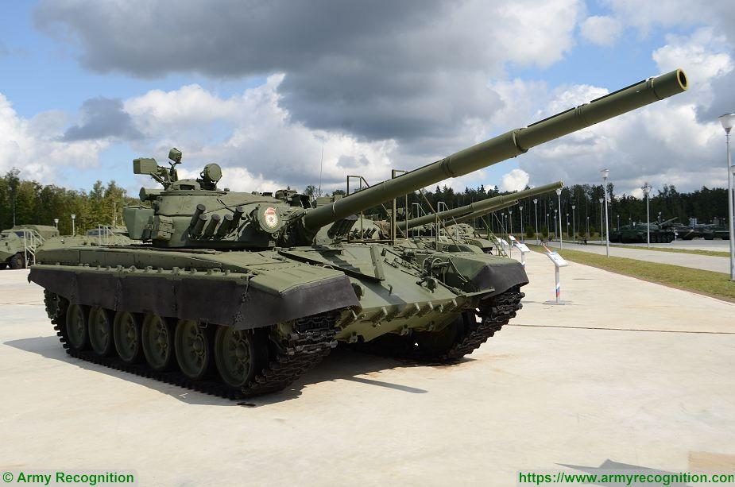

# Leopard 2A6

**Leopard 2A6** er en opgraderet version af den tyske Leopard 2 kampvogn, som er en del af Bundeswehr, det tyske forsvar. Denne kampvogn er en af de mest avancerede og slagkraftige kampvogne i verden, og den har cementeret sin position som en nøglekomponent i moderne pansrede enheder på grund af dens imponerende kombination af ildkraft, mobilitet og beskyttelse.

## Design og specifikationer:

1. **Bevæbning:**  
   * **Hovedbevæbningen** på Leopard 2A6 er en opgraderet **120 mm Rheinmetall L/55 glatløbet kanon**, der erstatter den tidligere L/44-version. Denne længere kanon giver forbedret præcision og højere udgangshastighed for projektiler, hvilket øger kampvognens effektivitet mod tungt pansrede fjendtlige mål på længere afstande.  
   * Den kan anvende flere typer ammunition, herunder **APFSDS (Armor-Piercing Fin-Stabilized Discarding Sabot)**, som er designet til at trænge igennem moderne kampvogne, og **HEAT (High-Explosive Anti-Tank)** ammunition til bekæmpelse af både pansrede og bløde mål.  
   * Ud over hovedkanonen har Leopard 2A6 et **7,62 mm MG3 maskingevær** monteret koaksialt ved siden af kanonen, samt et yderligere maskingevær på tårnet til anti-infanteribrug.  
2. **Panser og beskyttelse:**  
   * Leopard 2A6 er udstyret med **modulært kompositpanser**, som giver en overlegen beskyttelse mod både kinetiske projektiler og eksplosive trusler. Panseret kan modstå avancerede trusler som sprængladninger (IED'er) og raketdrevne granater (RPG'er).  
   * Forbedringerne i tårnpansringen, særligt på fronten og siderne, giver kampvognen øget overlevelsesevne, selv mod de nyeste panserskærende våben.  
   * Besætningen er yderligere beskyttet af **anti-splinter foring** inde i kampvognen, hvilket mindsker risikoen for skader fra sekundære fragmenter under kamp.  
3. **Mobilitet:**  
   * Leopard 2A6 er drevet af en **MTU MB 873 Ka-501 12-cylindret dieselmotor**, der yder 1.500 hestekræfter, hvilket giver kampvognen en topfart på omkring 68 km/t på vej og cirka 50 km/t i terræn.  
   * Den har en rækkevidde på cirka **500 km** takket være sin store brændstoftank, hvilket giver den stor operationel fleksibilitet.  
   * Den avancerede **hydropneumatiske affjedring** gør, at kampvognen kan bevæge sig hurtigt gennem vanskeligt terræn, og den er kendt for sin terrænevne under forskellige vejrforhold, hvilket er essentielt i moderne kamp.  
4. **Avancerede systemer:**  
   * Leopard 2A6 har et **forbedret ildkontrolsystem**, som muliggør præcise skud under bevægelse. Systemet inkluderer laserafstandsmålere, termiske kameraer og ballistiske computere, der sikrer hurtig og præcis måludpegning både dag og nat.  
   * **Stabilisering** af både kanon og tårn gør det muligt at affyre med høj nøjagtighed, selv mens kampvognen kører over ujævnt terræn eller i høj fart.  
   * Kampvognen er også udstyret med et **NBC-beskyttelsessystem (Nuclear, Biological, Chemical)**, som beskytter besætningen mod atomare, biologiske og kemiske våben under krigssituationer.  
5. **Besætning:**  
   * Leopard 2A6 opereres af en besætning på fire: **kommandør, skytte, lader og kører**. Besætningsmedlemmerne har moderne ergonomiske arbejdsstationer, som gør det muligt for dem at operere effektivt under kamp, og der er kommunikationssystemer, der holder dem forbundet med andre enheder.

## Opgraderinger fra tidligere modeller:

* En af de mest markante forskelle mellem Leopard 2A6 og tidligere modeller (som Leopard 2A4 og Leopard 2A5) er den længere **120 mm L/55 kanon**, som giver øget slagkraft og rækkevidde.  
* Forbedret **modulært panser**, som kan tilpasses forskellige trusler og opgraderes efter behov. Især front- og tårnpansringen er blevet kraftigt forbedret for at beskytte mod moderne panserbrydende våben.  
* Leopard 2A6 har også forbedret **mobilitet** og affjedring sammenlignet med tidligere versioner, hvilket gør den endnu mere terrændygtig.

## Operationel brug:

Leopard 2A6 er blevet brugt af Bundeswehr i mange internationale operationer, herunder NATO-øvelser og fredsbevarende missioner. Den har vist sig at være yderst pålidelig og modstandsdygtig i kamp. På grund af dens kombination af ildkraft, beskyttelse og mobilitet er Leopard 2A6 blevet betragtet som en af de mest slagkraftige kampvogne i verden, og den har inspireret mange andre lande til at anskaffe eller udvikle lignende kampvogne.

## Konklusion:

Leopard 2A6 repræsenterer højdepunktet inden for moderne kampvognsteknologi. Med sine avancerede våbensystemer, beskyttelsesforanstaltninger og overlegen mobilitet er den en afgørende komponent i Tysklands væbnede styrker og en af de mest imponerende kampvogne i global militær historie. Leopard 2A6's evne til at engagere fjender effektivt og beskytte sin besætning gør den til en uvurderlig ressource på moderne slagmarker.