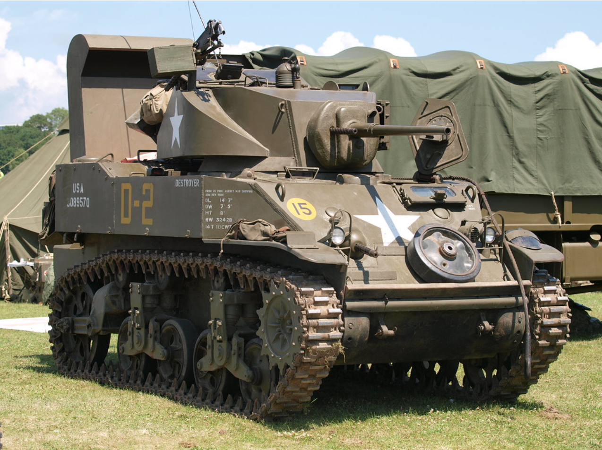

# Panzer IV G

## Panzer IV G (Sd.Kfz. 161/2)

Panzer IV var en af de mest ikoniske og mest producerede tyske kampvogne under Anden Verdenskrig. Den blev oprindeligt designet i begyndelsen af 1930'erne som en infanteristøttetank, der skulle komplementere Panzer III, som var beregnet til at bekæmpe fjendtlige kampvogne. Panzer IV's primære rolle var at yde støtte til infanteriet ved hjælp af sprænggranater rettet mod bløde mål og fjendens befæstninger. Som krigen udviklede sig, ændrede Panzer IV dog sin rolle og blev opgraderet med stadig kraftigere bevæbning for at kunne møde de mere velbeskyttede allierede kampvogne.

## Panzer IV G-varianten
 markerede et vigtigt skift i kampvognens rolle. Tidligere versioner af Panzer IV var hovedsageligt udrustet med kortløbede 75 mm kanoner (KwK 37), der var effektive mod infanteri og lette mål, men ineffektive mod tungere pansrede køretøjer. I lyset af mødet med kraftigere sovjetiske kampvogne som T-34 og KV-1 på Østfronten blev Panzer IV G omdesignet til at kunne udfordre disse modstandere. Den mest markante ændring i denne version var introduktionen af den langløbede 75 mm KwK 40 L/43 kanon. Denne nye kanon havde en langt højere mundingshastighed, hvilket øgede dens evne til at gennembryde fjendtligt panser på betydelige afstande, en nødvendig forbedring i mødet med de bedre pansrede fjendtlige kampvogne.

Produktionen af Panzer IV G begyndte i april 1942 og løb frem til juni 1943\. I alt blev omkring 1.687 eksemplarer af denne variant produceret. Udover den opgraderede bevæbning modtog Panzer IV G også forbedringer af sin rustning. Den forreste pansring blev øget til 80 mm, hvilket gav den øget beskyttelse mod fjendtlige antitankvåben, især på slagmarkerne på Østfronten, hvor de tyske panserstyrker kæmpede mod store mængder sovjetiske kampvogne og infanteri udstyret med kraftige antitankkanoner.

En anden væsentlig ændring var introduktionen af en ny type visuelt camouflagebeskyttelse kaldet "Schürzen" (pansernederdele), som blev monteret på siderne af kampvognen for at beskytte mod panserværnsgranater og huleladningsvåben. Denne form for beskyttelse var særligt vigtig i bykampe og på slagmarker, hvor infanteri ofte kunne komme tæt på kampvognene.

Panzer IV G var en alsidig kampvogn, der blev anvendt på flere krigsskuepladser, herunder Østfronten og i Nordafrika under feltmarskal Erwin Rommel. Den spillede en afgørende rolle i tyske panserdivisioners evne til at udfordre de allierede styrker, og dens opgraderinger gjorde den i stand til at holde trit med de allieredes forbedringer af deres kampvogne, som f.eks. den sovjetiske T-34 og den amerikanske M4 Sherman.

Trods sine forbedringer begyndte Panzer IV G at vise tegn på forældelse, efterhånden som endnu kraftigere allierede kampvogne, som den sovjetiske IS-2 og den amerikanske M26 Pershing, kom ind på slagmarken. Alligevel forblev Panzer IV grundstenen i den tyske panserstyrke indtil krigens slutning, da den mere avancerede Panther-kampvogn (Panzer V) ikke kunne produceres i tilstrækkelige mængder til helt at erstatte Panzer IV. Panzer IV G’s robuste konstruktion og kontinuerlige opgraderinger gjorde den til en af de mest pålidelige tyske kampvogne under Anden Verdenskrig.