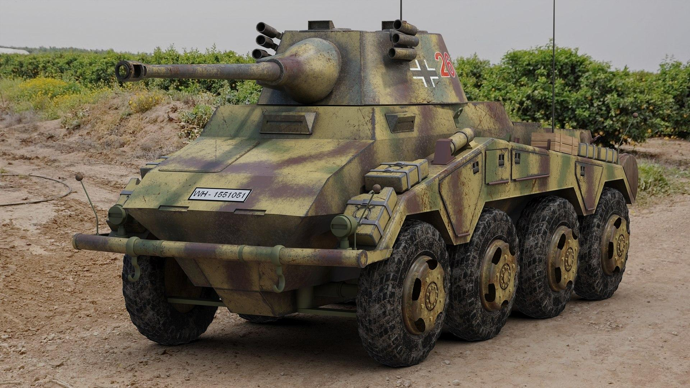

# Panzerkampfwagen VI Tiger I (Tiger)

**Panzerkampfwagen VI Tiger** er en af de mest ikoniske tyske tunge kampvogne fra Anden Verdenskrig. Dens frygtindgydende ildkraft, tykke panser og imponerende størrelse gjorde den til en af de mest respekterede og frygtede kampvogne på slagmarken. Tigerens overlegenhed i kamp blev hurtigt legendarisk, selvom dens begrænsninger og teknologiske kompleksitet også blev udfordringer for tyskerne i krigens sidste år.

## Design og specifikationer:

1. **Bevæbning:**  
   * Hovedbevæbningen på Tiger I er en **8,8 cm KwK 36 L/56** kanon, som var en af de mest effektive kampvognskanoner under krigen. Denne kanon var i stand til at penetrere de fleste allierede kampvogne på betydelige afstande og havde en imponerende rækkevidde og nøjagtighed. 8,8 cm kanonen havde sin oprindelse som et luftværnsvåben (Flak), men viste sig også at være ekstremt effektiv mod pansrede mål.  
   * Kampvognen havde også to **7,92 mm MG34 maskingeværer** – et koaksialt monteret ved siden af hovedkanonen og et andet i skroget til infanteribekæmpelse og nærforsvar.  
2. **Panser:**  
   * En af de mest imponerende egenskaber ved Tiger I var dens tykke panser. Frontpanseret var **100 mm tykt**, mens siderne havde **80 mm** panser, hvilket gjorde den ekstremt modstandsdygtig mod de fleste allierede våben på krigens tidlige og midterste stadier. Panserets store tykkelse gav Tiger I en betydelig defensiv fordel i kamp mod både sovjetiske T-34 og amerikanske M4 Sherman kampvogne.  
   * Panserets flade design gjorde dog, at det ikke var så effektivt som de skrå pansrede kampvogne, som Sovjet og senere Tyskland selv udviklede, hvor skråt panser var mere modstandsdygtigt på grund af ricochet-effekten.  
3. **Mobilitet:**  
   * Tiger I var drevet af en **Maybach HL230 P45 V12 benzinmotor**, der leverede 700 hk. På trods af dens vægt på omkring **57 tons**, kunne kampvognen opnå en maksimal hastighed på **45 km/t** på veje og omkring **20 km/t** i terræn.  
   * Selvom Tiger I var relativt hurtig på lige og jævnt terræn, var dens størrelse og vægt en betydelig ulempe i mudder, sne og bjergområder, hvor dens mobilitet ofte blev hæmmet.  
   * En af de store teknologiske udfordringer ved Tiger I var dens komplekse transmission og affjedringssystem, som ofte havde tendens til at gå i stykker under strabadserne på slagmarken. Dette resulterede i et højt vedligeholdelsesbehov og mange nedbrud.  
4. **Besætning:**  
   * Tiger I blev betjent af en besætning på fem mand: **kommandør, skytte, lader, kører og radiotelegrafist/maskingskytte**. Hver besætningsmedlem havde en specifik rolle i betjeningen af den komplekse kampvogn, og samspillet mellem dem var afgørende for Tigerens effektivitet i kamp.  
   * Kampvognen var udstyret med radioer til kommunikation mellem besætningen og andre kampvogne i enheden, hvilket var en stor fordel på slagmarken.  
5. **Ildstyring og præcision:**  
   * Tiger I havde et relativt avanceret ildkontrolsystem for sin tid, herunder optiske sigtemidler, der tillod præcise skud på op til **2-3 kilometers afstand**. Dette gjorde Tiger I særligt farlig i defensive positioner, hvor den kunne udnytte sin overlegen rækkevidde til at nedkæmpe fjendtlige kampvogne på stor afstand, inden de overhovedet kunne svare igen.

## Operationel historie:

* Tiger I blev introduceret i 1942 og blev først brugt i kamp på **Østfronten** mod de sovjetiske styrker. Dens ildkraft og panser gjorde den hurtigt til et frygtindgydende våben mod de sovjetiske kampvogne, især T-34. Tigerens præstation i kamp blev hurtigt en legende, og dens evne til at engagere flere fjendtlige kampvogne på én gang gjorde den til en "elite" kampvogn, ofte kommanderet af nogle af Tysklands bedste tankkommandører, såsom **Michael Wittmann**.  
* Tiger I blev også brugt på **Vestfronten**, hvor den deltog i kampagner i Nordafrika, Italien og senere i Frankrig efter D-Dagen i 1944\. På trods af dens styrke var Tiger I sjældent produceret i store mængder, med kun omkring **1.347 enheder** bygget under hele krigen. Dette var delvist på grund af dens kompleksitet og de store ressourcer, der var nødvendige for at producere og vedligeholde den.  
* Tigerens store vægt og størrelse gjorde den også sårbar over for mekaniske nedbrud og logistiske problemer. Mange blev ofte forladt på slagmarken på grund af mangel på reservedele eller brændstof.

## Begrænsninger:

* **Vedligeholdelse og logistik**: Tiger I's kompleksitet og mekaniske skrøbelighed betød, at den havde brug for konstant vedligeholdelse. Dette var især et problem i felten, hvor ressourcer var knappe, og tyskerne kæmpede mod overvældende fjendtlige styrker.  
* **Brændstofforbrug**: Tiger I var ekstremt brændstofkrævende, og i krigens sidste år led Tyskland under alvorlige brændstofmangel, hvilket begrænsede Tigerens operationelle rækkevidde og kapacitet.  
* **Produktionsomkostninger**: På grund af dens komplekse design og høje omkostninger, blev der produceret relativt få Tiger I kampvogne sammenlignet med enklere modeller som **Panzer IV** eller **Sturmgeschütz III**, som tyskerne kunne producere i større antal.

## Konklusion:

Panzer VI Tiger I var en teknologisk bedrift og en af de mest ikoniske kampvogne i militærhistorien. Dens ildkraft og beskyttelse gjorde den til en formidabel modstander på slagmarken, og den skabte en psykologisk effekt på fjenden. Dog viste dens høje produktionsomkostninger, mekaniske kompleksitet og logistiske problemer sig som store begrænsninger, hvilket betød, at dens samlede indflydelse på krigen var begrænset. Tiger I forbliver en af de mest genkendelige symboler på tysk panserstyrke i Anden Verdenskrig.