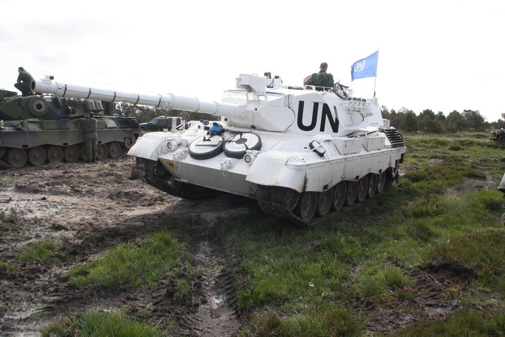

# Panzerkampfwagen VI Tiger II (Königstiger)

**Panzerkampfwagen VI Tiger II**, også kendt som **Königstiger** (King Tiger) eller **Tiger II**, var en tung tysk kampvogn, der blev introduceret under **Anden Verdenskrig**. Den kombinerede den tunge panserbeskyttelse og ildkraft fra den tidligere **Tiger I** med det skråt panserdesign, der var karakteristisk for den succesfulde **Panther-kampvogn**. Det gjorde Königstiger til en af de mest frygtindgydende kampvogne i krigens sidste år, selvom dens størrelse og kompleksitet også medførte udfordringer.

## Design og specifikationer:

1. **Bevæbning:**  
   * Hovedbevæbningen på Tiger II var den kraftfulde **8,8 cm KwK 43 L/71** kanon, en videreudvikling af den 8,8 cm kanon, der også blev brugt i Tiger I. KwK 43 var endnu længere, hvilket betød større mundingshastighed og dermed større gennemslagskraft.  
   * Med sin kanon var Tiger II i stand til at penetrere stort set alle allierede kampvogne på afstande over 2 km. KwK 43 kunne trænge igennem **200 mm panser** på over 1.000 meters afstand, hvilket gjorde den effektiv mod de fleste modstandere på slagmarken.  
   * Ligesom Tiger I havde Tiger II også et koaksialt **7,92 mm MG34** maskingevær ved siden af hovedkanonen og et andet MG34 maskingevær monteret i skroget.  
2. **Panser:**  
   * Tiger II's panserskærm var en af dens mest imponerende egenskaber. Den forreste panserplade var **150 mm tyk**, skråtstillet for at maksimere beskyttelsen og afvise fjendtlige projektiler. Siderne af kampvognen havde **80 mm panser**, hvilket stadig var betydeligt tykkere end mange allierede kampvogne.  
   * Det skråtstillede panserdesign gjorde, at Tiger II kunne modstå direkte hits fra de fleste allierede våben, hvilket gav den en enorm fordel i defensive kampe.  
3. **Mobilitet:**  
   * Tiger II vejede omkring **69 tons**, hvilket gjorde den endnu tungere end sin forgænger, Tiger I. Denne øgede vægt påvirkede dens mobilitet, selvom den stadig blev drevet af en **Maybach HL230 P30 V12 benzinmotor**, der producerede **700 hk**.  
   * På veje kunne Tiger II nå en hastighed på **38 km/t**, mens den i terræn var begrænset til omkring **15-20 km/t**. Dette gjorde den forholdsvis langsom, især sammenlignet med allierede kampvogne som den amerikanske **M4 Sherman** eller den sovjetiske **T-34**.  
   * Vægt og størrelse gjorde Tiger II sårbar over for mekaniske problemer, og dens mobilitet blev yderligere begrænset i vanskeligt terræn, såsom mudder eller snedækkede områder, hvor dens affjedring ofte blev overbelastet.  
4. **Besætning:**  
   * Tiger II havde en besætning på fem mand: **kommandør, skytte, lader, kører og radiotelegrafist/maskingskytte**. Samarbejdet mellem besætningsmedlemmerne var afgørende for at kunne betjene kampvognens komplekse systemer og maksimere dens effektivitet i kamp.  
   * Besætningen var beskyttet af Tiger II's tykke panser, men kampvognen var også trang, og dens store varmeudvikling gjorde det ofte ubehageligt for besætningen under længere operationer.  
5. **Ildstyring og præcision:**  
   * Tiger II havde avancerede optiske sigtemidler, som tillod præcise skud på lange afstande. Kombinationen af den kraftfulde 8,8 cm KwK 43 og de præcise sigtemidler gjorde, at Tiger II kunne ramme og ødelægge fjendtlige kampvogne på afstande, hvor de fleste allierede kampvogne ikke kunne svare igen.  
   * Denne præcision gav Tiger II en stor fordel i åbne terræn, hvor dens ildstyrke og rækkevidde kunne udnyttes fuldt ud.

## Operationel historie:

* Tiger II blev introduceret i 1944 og deltog i de sidste store operationer på både **Østfronten** og **Vestfronten**. På trods af sin formidable ildkraft og pansring blev kun omkring **489 eksemplarer** produceret, hvilket gjorde den til en sjælden, men frygtet modstander.  
* Tiger II blev brugt af eliteenheder som **Schwere Panzerabteilung** (tunge kampvognsafdelinger), hvor den fungerede som en rygstøtte for tyske styrker i defensiv kamp. Dens tykke panser og stærke kanon gjorde den særlig velegnet til defensive stillinger, hvor den kunne engagere fjendtlige kampvogne på lang afstand.  
* **Slaget om Normandiet**, **Slaget om Ardennerne**, og de sidste kampe på Østfronten var nogle af de steder, hvor Tiger II blev sat ind. Den viste sig effektiv mod de fleste fjendtlige kampvogne, men dens tunge vægt og komplekse mekanik førte til mange tekniske problemer og begrænsede dens operative mobilitet.

## Begrænsninger:

* **Logistik**: Tiger II's størrelse og vægt skabte store logistiske udfordringer for tyskerne. Kampvognen var svær at transportere og krævede store mængder brændstof, som Tyskland havde mangel på i de sidste krigsår.  
* **Vedligeholdelse**: Som mange tunge tyske kampvogne var Tiger II meget vedligeholdelsestung. Mekaniske fejl var hyppige, og mange Tiger II'er blev forladt af deres besætninger, fordi de ikke kunne repareres i felten eller manglede reservedele.  
* **Brændstofforbrug**: Tiger II havde et ekstremt højt brændstofforbrug, hvilket betød, at den ofte blev immobiliseret, når forsyningslinjerne blev afskåret. Dette var særligt problematisk i krigens sidste fase, hvor Tyskland led under alvorlig brændstofmangel.

## Konklusion:

Tiger II, eller Königstiger, var et af de mest imponerende pansrede køretøjer under Anden Verdenskrig, både i form af ildkraft og pansring. Dens evne til at ødelægge fjendtlige kampvogne på lange afstande og dens tykke panser gjorde den til en af de mest frygtede kampvogne på slagmarken. På trods af dens teknologiske fordele var Tiger II dog hæmmet af dens komplekse design, høje vedligeholdelseskrav og logistiske udfordringer, som alle bidrog til at begrænse dens indflydelse på krigens udfald.