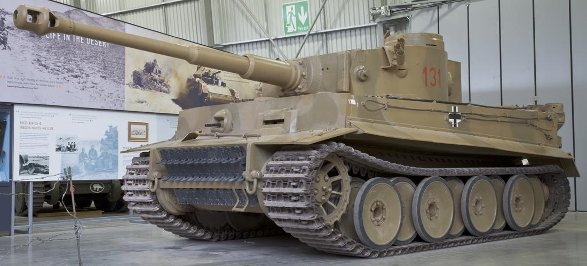

# Sd.Kfz. 234 Puma

 **Sd.Kfz. 234 Puma** var et tysk firehjulstrukket pansret opklaringskøretøj, som blev brugt af Wehrmacht under Anden Verdenskrig. Det tilhørte familien af **Schwerer Panzerspähwagen** (tungt pansret opklaringskøretøj) og var en af de mest avancerede køretøjer af sin type. Puma-varianten, som var kendt for sin bevæbning og mobilitet, blev produceret fra 1943 til 1945\.

## Design og Bevæbning:

Sd.Kfz. 234 Puma var designet til rekognoscering og opklaring i frontlinjen, hvor hastighed og ildkraft var afgørende. Nogle af de vigtigste kendetegn var:

1. **Bevæbning:**  
   * Puma var udstyret med en 50 mm KwK 39/1 kanon, hvilket gav den en betydelig ildkraft sammenlignet med andre opklaringskøretøjer fra samme periode. Denne kanon var i stand til at engagere let pansrede køretøjer og kunne også levere støtteild mod infanteri.  
   * Derudover havde Puma en 7,92 mm MG34 eller MG42 maskingevær monteret koaksialt med hovedkanonen for at engagere blødere mål som infanteri.  
2. **Panser:**  
   * Sd.Kfz. 234 Puma var pansret med en maksimal tykkelse på 30 mm foran, hvilket gav beskyttelse mod lettere våben og granatsplinter. Den var dog ikke designet til at modstå ild fra kampvognskanoner eller tunge antitankvåben.  
3. **Mobilitet:**  
   * Et af de mest markante træk ved Puma var dens fremragende mobilitet. Den var udstyret med en luftkølet 12-cylindret Tatra dieselmotor, som leverede en topfart på omkring 90 km/t på vej, hvilket gjorde den ekstremt hurtig i forhold til andre pansrede køretøjer.  
   * Puma havde også firehjulstræk og et avanceret uafhængigt hjulophæng, hvilket gav den fremragende terrænevner, så den kunne køre både på hårdt og blødt underlag.  
   * Et andet unikt designtræk var dens **to førerpositioner** — en forreste og en bageste. Dette gjorde det muligt for køretøjet at skifte retning uden at skulle vende om, hvilket var en stor fordel under rekognoscering og hurtige tilbagetrækninger.  
4. **Besætning:**  
   * Køretøjet blev bemandet af en fem-mands besætning: fører, skytte, lader, radiomand og bagudvendt fører. Denne konfiguration gjorde det muligt for køretøjet at opretholde høj effektivitet i kamp og under manøvrer.

## Operationel brug:

Puma blev primært brugt til opklaring og rekognoscering i frontlinjerne, hvor dens hastighed og ildkraft gjorde den til et effektivt redskab til at indsamle efterretninger og engagere fjendens lette styrker. Den blev ofte brugt til at trænge dybt ind i fjendtligt territorium, finde svagheder i fjendens linjer og rapportere disse tilbage til de tyske hovedkvarterer.

Selvom den ikke var lige så stærkt pansret som de fleste kampvogne, blev Puma respekteret for sin evne til hurtigt at engagere fjenden og derefter trække sig tilbage ved høj hastighed. Den blev brugt i både Øst- og Vestfronten, hvor dens mobilitet og ildkraft blev udnyttet fuldt ud.

## Varianter:

Selvom **Sd.Kfz. 234/2 Puma** var den mest kendte variant i serien, var der flere versioner af Sd.Kfz. 234 med forskellig bevæbning:

* **Sd.Kfz. 234/1** var bevæbnet med en 20 mm KwK 38 kanon, og den blev brugt til let opklaring.  
* **Sd.Kfz. 234/3** var udstyret med en 75 mm kortløbet KwK 37 L/24 kanon og blev brugt som en støtteenhed.  
* **Sd.Kfz. 234/4** havde en 75 mm PaK 40 antitankkanon monteret, hvilket gjorde den i stand til at engagere fjendtlige kampvogne.

## Indsats til krigens afslutning:

Sd.Kfz. 234 Puma var en af de mest avancerede pansrede opklaringskøretøjer i tysk tjeneste under krigen, men på grund af den relativt begrænsede produktion nåede den aldrig at få en massiv indflydelse på krigens udfald. De eksemplarer, der blev produceret, blev dog betragtet som meget effektive og værdsatte af de tyske styrker.

I løbet af krigens sidste år blev Puma brugt i desperate forsvarskampe på begge fronter, hvor den fortsatte med at spille en vigtig rolle i opklaring, men også som en mobil antitankenhed i det kaotiske krigsmiljø.