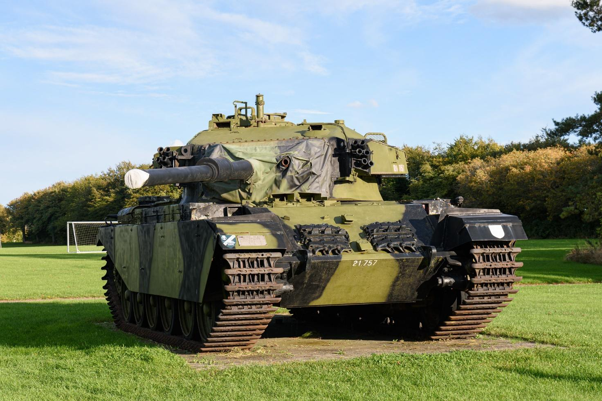

# Sherman M4A3 76(w)

M4 Sherman-tanken blev produceret i mange forskellige varianter som resultat af masseproduktion fra flere producenter. Den oprindelige M4 blev designet i 1941, og varianterne blev brugt af Israel under både Seksdageskrigen i 1967 og Yom Kippur-krigen i 1973\. Shermans blev løbende opgraderet med bedre bevæbning og rustning for at kunne imødegå nye trusler.

I forberedelse til invasionen af Europa i 1944 blev der udviklet en amfibisk version af Sherman-tanken, og mange Shermans blev tilpasset til særlige formål, som eksempelvis minefjernelse med Sherman Crab-minerydningstanken. Efter krigen blev overskydende Shermans solgt til mange lande, og Israel blev den største bruger af Sherman-modellerne i efterkrigstiden.