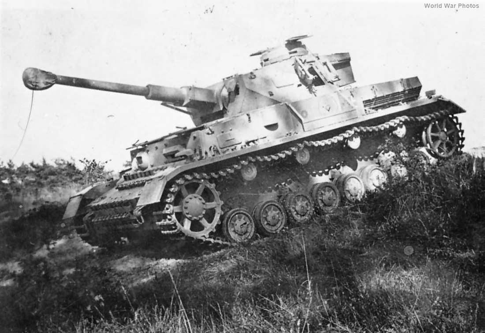

# Stuart M5A1

 
M5A1 Stuart var en opgraderet version af den amerikanske lette M3 Stuart-tank, som blev brugt bredt under Anden Verdenskrig. M5A1 havde en forbedret tårnmodel, bedre kommunikationsudstyr og bedre beskyttelse. I alt blev der produceret 6.810 M5A1, og mange tidlige modeller blev moderniseret med senere produktionsændringer.

M5A1 blev primært brugt i Stillehavskrigen mod Japan, hvor den med sin hurtighed og bevægelighed var en effektiv kampvogn mod mindre japanske tanks, selvom den havde svagere bevæbning og rustning end sine tyske modstandere på andre krigsskuepladser.
