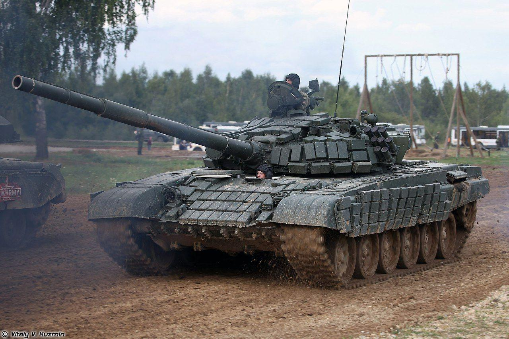

# T-72

De tidlige versioner af den sovjetiske **T-72 kampvogn** blev introduceret i 1960'erne og har haft en betydelig indflydelse på moderne pansrede køretøjer. T-72 blev designet som en billigere og lettere erstatning for T-64, og den kom til at spille en vigtig rolle i den sovjetiske og senere post-sovjetiske militære doktrin. Her er en beskrivelse af de tidlige versioner af T-72:

## T-72 (Modellerne T-72A og T-72B)

### T-72A

* **Introduktion:** T-72A blev introduceret i **1973** som en opgradering af den oprindelige T-72-model.  
* **Bevæbning:** Hovedkanonen var en **125 mm smoothbore D-81T**, som gav T-72A en betydelig ildkraft sammenlignet med tidligere kampvogne. Den kunne affyre både sprænggranater og panserbrydende projektiler.  
* **Panser:** T-72A havde et skrogsdesign med en tykkelse på **45 mm** foran, mens tårnet var beskyttet af op til **90 mm** panser. Dette design var skråtstillet for at maksimere beskyttelsen mod indkommende projektiler.  
* **Mobilitet:** T-72A blev drevet af en **V-12 dieselmotor**, der kunne levere **780 hk**, hvilket gav kampvognen en maksimal hastighed på op til **60 km/t** på vej og **40 km/t** i terræn. Den havde en rækkevidde på omkring **450 km** på asfalt og **300 km** i terræn.  
* **Besætning:** T-72A havde en besætning på **3 mand**: kommandør, skytte og kører, hvilket var en kompakt besætning sammenlignet med mange vestlige kampvogne.  
* **Taktisk anvendelse:** T-72A blev anvendt i store mængder af den sovjetiske hær og de fleste af dens allierede styrker i Warszawapagten. Den blev brugt i mange konflikter, herunder krigen i Afghanistan.

### T-72B

* **Introduktion:** T-72B blev introduceret i **1985** og var en yderligere forbedring af T-72A.  
* **Bevæbning:** T-72B bevarede den samme 125 mm D-81T kanon, men den blev opgraderet til at affyre de moderne **3BM-32** panserbrydende projektiller, hvilket forbedrede dens evne til at bekæmpe mere moderne pansrede køretøjer.  
* **Panser:** T-72B havde et forbedret panserdesign med tilføjelsen af **kontakt 1** reaktiv panserbeskyttelse, som kunne nedbringe effekten af indkommende projektiler betydeligt. Tårnet var designet til at modstå angreb fra moderne anti-tank våben.  
* **Mobilitet:** T-72B havde også den samme V-12 dieselmotor som T-72A, men den havde forbedrede affjedringssystemer, hvilket gjorde den mere mobil og bedre tilpasset til hårde terrænforhold.  
* **Kampstyring:** T-72B introducerede et moderne **fjernaflæsningssystem** og bedre optiske sigtemidler, hvilket forbedrede dens effektivitet i kamp.

## Generelle træk for de tidlige T-72 versioner:

* **Produktion:** T-72 blev produceret i store mængder, og det anslås, at der blev bygget over **20.000** enheder af forskellige versioner.  
* **Krigsdeltagelse:** T-72 har været en central del af mange konflikter, herunder den irakiske krig mod Iran, Gulfkrigen og de senere konflikter i det tidligere Jugoslavien og Syrien. Den blev også brugt af mange af de tidligere sovjetiske republikker og allierede lande, hvilket har gjort den til en af de mest udbredte kampvogne i verden.  
* **Moderne opgraderinger:** Mange lande har opgraderet deres T-72 kampvogne med moderne teknologi, hvilket har forlænget deres operativ levetid og forbedret deres kampkapaciteter.

## Konklusion

De tidlige versioner af T-72, herunder T-72A og T-72B, satte standarden for moderne kampvognsdesign med deres kombination af ildkraft, mobilitet og panserbeskyttelse. T-72 har bevist sig som en alsidig og pålidelig kampvogn, der har haft en betydelig indflydelse på pansrede styrker verden over.

De nyere versioner af **T-72** kampvognen er blevet udviklet og opgraderet for at forbedre deres kapaciteter og forlænge deres operativ liv. Disse opgraderinger har gjort T-72 til en stadig relevant kampvogn i moderne krigføring, selvom den oprindelige design er over 50 år gammel. Her er en beskrivelse af nogle af de nyere versioner:

### T-72B3

* **Introduktion:** T-72B3 blev introduceret i 2010 som en opgradering af T-72B. Det er en del af det russiske militærs moderniseringsprogram.  
* **Bevæbning:** T-72B3 er udstyret med en forbedret **125 mm 2A46M** kanon, der kan affyre en bred vifte af projektiler, inklusive moderne panserbrydende projektiler som 3BM-42 "Mango" og 3BM-48 "Svinets". Den kan også affyre **ATGM** (Anti-Tank Guided Missiles) fra kanonen.  
* **Panser:** T-72B3 har fået opgraderet panserbeskyttelse, herunder forbedret **kontakt 5** reaktiv panser, som yderligere øger beskyttelsen mod moderne anti-tank våben. Tårnet er også blevet designet med tykkere panser og højere modstandsdygtighed over for indkommende projektiler.  
* **Mobilitet:** Den er udstyret med en moderne **V-92S2** dieselmotor, der yder omkring **1.000 hk**, hvilket forbedrer dens hastighed og manøvredygtighed.  
* **Kampstyring:** T-72B3 har moderne optik, herunder termisk sigteudstyr og avanceret sigtesystem, hvilket forbedrer skudpræcisionen og evnen til at operere i lavlysforhold.

### T-72B3M

* **Introduktion:** T-72B3M er en yderligere opgradering af T-72B3, der blev implementeret fra 2016\.  
* **Bevæbning:** Den har de samme våbensystemer som T-72B3, men med opgraderinger til den digitale kommunikation og kampledelse.  
* **Panser:** T-72B3M har forbedret reaktiv panserbeskyttelse og ekstra kompositmaterialer for at øge den passive beskyttelse. Den har også moduler til at tilføje ekstra beskyttelse i forskellige missioner.  
* **Mobilitet:** Ligesom T-72B3 har den den samme kraftfulde motor, men med forbedret affjedring for bedre præstation i hårdt terræn.  
* **Kampstyring:** T-72B3M er udstyret med moderne digitale kommunikationssystemer, hvilket gør det lettere for besætningen at integrere med andre enheder på slagmarken og udveksle information i realtid.

### T-72S

* **Introduktion:** T-72S blev designet til eksport og introduceret i 1990'erne. Det er en variant, der retter sig mod udenlandske brugere.  
* **Bevæbning:** Ligesom de andre T-72-versioner, er den udstyret med en 125 mm kanon, men den kan også have andre forbedringer baseret på kundeønsker.  
* **Panser:** T-72S har en kombination af kompositpanser og reaktive beskyttelsessystemer, som kan tilpasses afhængigt af kundens krav.  
* **Mobilitet og elektronik:** Den har generelt de samme motor- og mobilitetsegenskaber som T-72A, men kan have forskellige upgrades i form af elektronisk udstyr og kommunikationssystemer.

### T-72M1

* **Introduktion:** T-72M1 er en opgraderet version af den oprindelige T-72 designet til eksport til Warsaw Pact-lande og andre allierede nationer.  
* **Bevæbning:** Den er udstyret med en 125 mm kanon og har en tilpasset version af den sovjetiske D-81T kanon.  
* **Panser:** T-72M1 har forbedret panserbeskyttelse i forhold til den oprindelige T-72, men den er stadig ikke på niveau med de nyere opgraderinger.  
* **Mobilitet:** Den opretholder de klassiske T-72 mobilitetsstandarder med god hastighed og manøvredygtighed.

**Generelle træk for nyere T-72-versioner:**

* **Moderne teknologi:** Nyere versioner af T-72 er udstyret med moderne teknologi og systemer, herunder digital kommunikation, avanceret sigtesystemer, og reaktive panserbeskyttelsessystemer.  
* **Lang levetid:** Mange T-72 versioner er blevet opgraderet af forskellige lande, hvilket giver dem en lang levetid i aktive tjeneste og gør dem i stand til at konkurrere med moderne kampvogne.  
* **Brug i konflikter:** T-72 har fortsat at spille en rolle i moderne konflikter, herunder i Syrien og Ukraine, hvor de har vist sig at være alsidige og effektive, selv mod moderne trusler.

## Konklusion

De nyere versioner af T-72 har været afgørende for at opretholde relevansen af denne klassiske kampvogn i moderne krigføring. Med konstant forbedring af bevæbning, beskyttelse og teknologi fortsætter T-72 med at være en vigtig del af mange landes pansrede styrker.